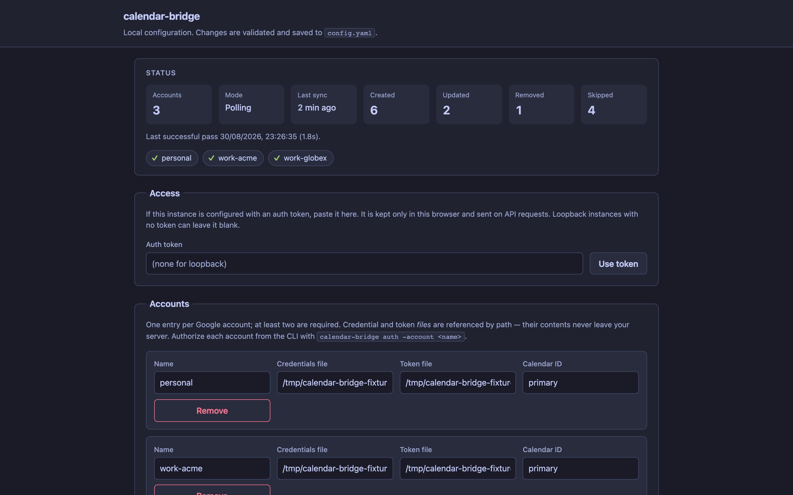
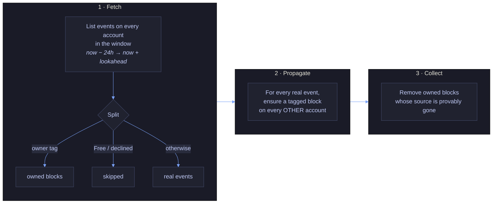
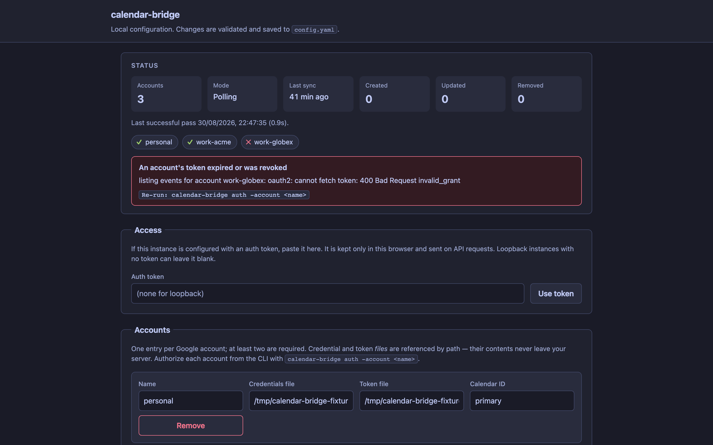
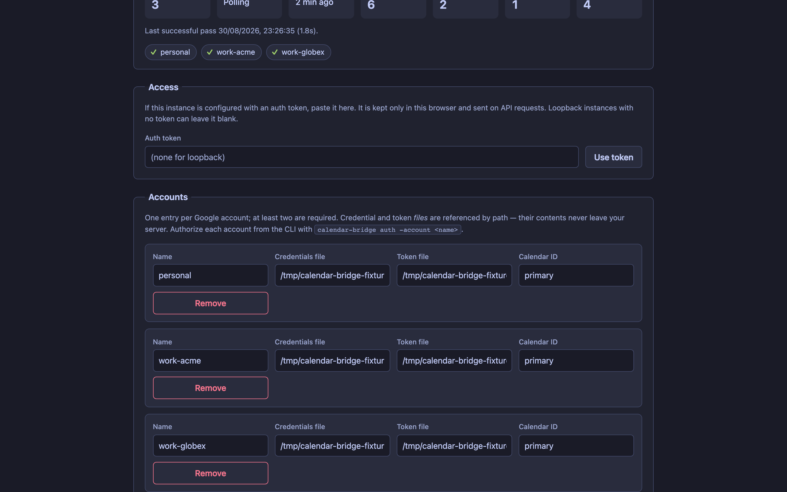
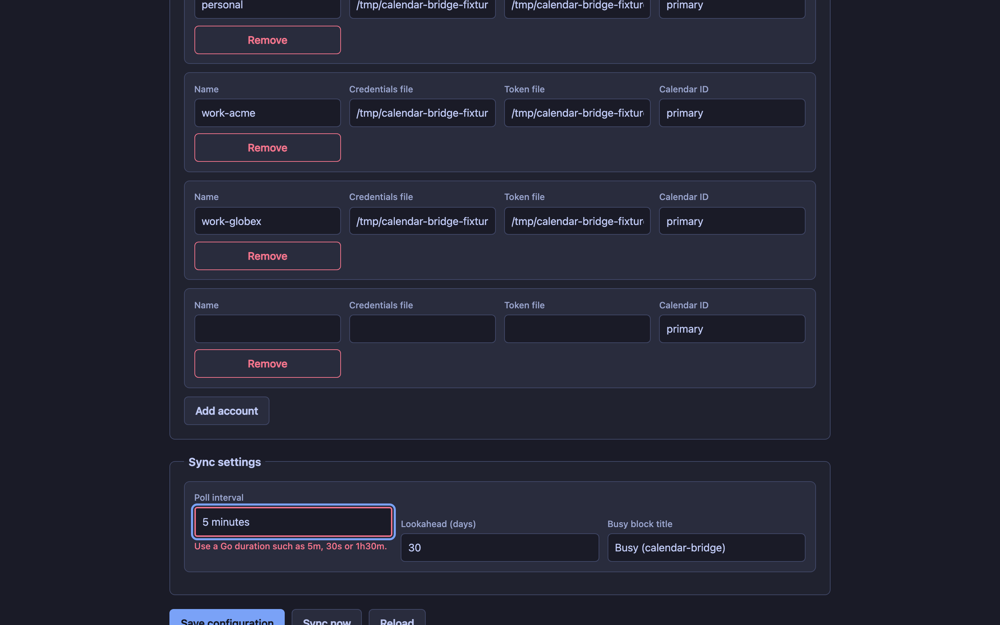
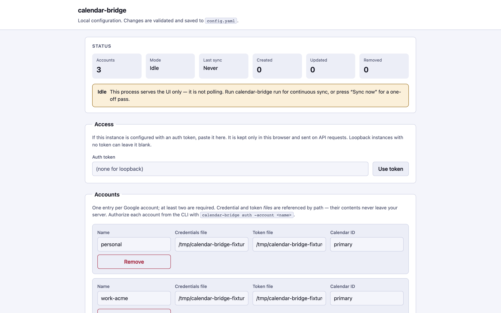
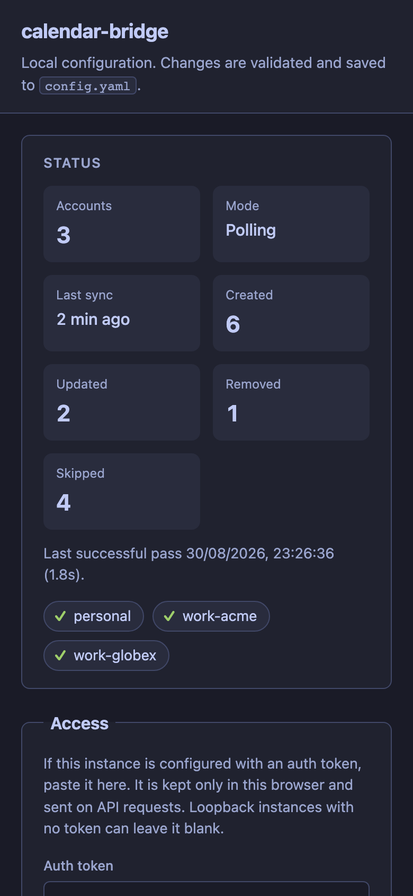

<div align="center">


<a href="https://dcotelo.dev">
  
</a>

<br/>

[](docs/)
[](https://dcotelo.dev)
[](https://github.com/dcotelo/calendar-bridge/issues/new/choose)

[](https://github.com/dcotelo/calendar-bridge/actions/workflows/ci.yml)
[](https://github.com/dcotelo/calendar-bridge/actions/workflows/codeql.yml)
[](https://pkg.go.dev/github.com/dcotelo/calendar-bridge)
[](https://goreportcard.com/report/github.com/dcotelo/calendar-bridge)
[](https://scorecard.dev/viewer/?uri=github.com/dcotelo/calendar-bridge)
[](go.mod)
[](https://github.com/dcotelo/calendar-bridge/releases)
[](https://github.com/dcotelo/calendar-bridge/pkgs/container/calendar-bridge)
[](LICENSE)
[](CODE_OF_CONDUCT.md)


**Self-hosted busy-time sync across multiple Google Calendar accounts.**
One meeting on one calendar blocks the slot on all the others — without any
third-party service ever seeing your calendar.

</div>

---

<div align="center">
  
</div>

---

## Contents

- [Why this exists](#why-this-exists)
- [What it does](#what-it-does)
- [What it deliberately does not do](#what-it-deliberately-does-not-do)
- [Quickstart](#quickstart)
- [How it works](#how-it-works)
- [Screenshots](#screenshots)
- [Configuration](#configuration)
- [Deployment](#deployment)
- [Security and privacy](#security-and-privacy)
- [Known limitations](#known-limitations)
- [Roadmap](#roadmap)
- [Contributing](#contributing)

---

## Why this exists

Google Calendar has no native way to block time across separate accounts, and
it is worse across different Workspace domains — a personal Gmail account plus
one or more employers or clients, each with its own admin and its own tenant.
Nobody can see anybody else's calendar, so everybody books you at 2pm.

Hosted tools solve this well. The trade is that your event data flows through
their servers to do it.

For plenty of people that is fine. If it is not — because of a work policy, a
client NDA, or plain preference — calendar-bridge does the same job entirely on
infrastructure you control. **Nothing leaves your machine except ordinary
Calendar API calls to Google**, which already has your calendar. No analytics,
no telemetry, no update check, no server to be breached.

That is the whole argument. If it does not move you, use a hosted tool; they are
less work.

---

## What it does

- Polls the Google Calendar accounts you authenticate. Tokens never leave your
  infrastructure.
- When a real event appears, moves, or disappears on one calendar, creates,
  moves, or removes a matching **"Busy"** block on every other configured
  calendar.
- Tags every block it creates with a private `calendarBridgeOwner` extended
  property. That one bit is what lets it tell "a placeholder I made" from "a real
  event a human made" — which is what prevents sync loops and makes it safe to
  delete anything at all.
- Propagates **free/busy state only**. Titles, descriptions, locations and
  attendees never cross an account boundary; the block's title is a fixed string
  you configure.
- Skips events you marked **Free** and invitations you **declined**. Declining a
  meeting and still losing the slot everywhere else would be the most annoying
  thing this tool could do.
- Isolates failures per account. An expired token on one account does not stop
  the others syncing — and, importantly, does not cause its blocks to be
  garbage-collected elsewhere.

## What it deliberately does not do

- **Not a two-way mirror.** Event content is never copied. Only a generic
  placeholder crosses. This is enforced by the type system, not by convention —
  see [ADR 0003](docs/adr/0003-no-event-content-propagation.md).
- **Polling by default, not real-time.** Default latency is up to
  `poll_interval` (5 minutes). [Push notifications](docs/webhooks.md) are opt-in
  for near-instant propagation; polling stays on as the safety net.
- **Not a multi-calendar overlay.** Google's own "other calendars" sidebar
  already does that within one account.
- **Not multi-user.** One process serves one person's set of accounts.
- **No hosted component.** There is nothing to sign up for.

---

## Quickstart

The fastest path from nothing to a first sync.

### 1. Create OAuth credentials, once per account

For each Google account you want to sync:

1. Create or select a project in the [Google Cloud Console](https://console.cloud.google.com/).
2. Enable the **Google Calendar API**.
3. Create an **OAuth 2.0 Client ID**, application type **Desktop app**.
4. Download the credentials JSON.
5. Under **APIs & Services → OAuth consent screen**, set the publishing status
   to **In production**.

> **Step 5 matters more than it looks.** In **Testing** status Google expires
> refresh tokens after seven days, and you will be re-authorizing every account
> every week forever. Production status needs no verification review for an app
> only you use — you click through an "unverified app" interstitial during the
> next step.

### 2. Install

```bash
go install github.com/dcotelo/calendar-bridge/cmd/calendar-bridge@latest
calendar-bridge version
```

Or grab a [release binary](https://github.com/dcotelo/calendar-bridge/releases),
or use the container image (`ghcr.io/dcotelo/calendar-bridge`) — but do the
authorization below on a machine with a browser either way.

### 3. Configure

```bash
mkdir -p ~/.config/calendar-bridge/secrets
chmod 700 ~/.config/calendar-bridge/secrets
cd ~/.config/calendar-bridge
# put each downloaded credentials JSON in secrets/
```

Write `config.yaml`. Use **absolute paths** — they are resolved against the
process's working directory, not against this file:

```yaml
accounts:
  - name: personal
    credentials_file: /home/you/.config/calendar-bridge/secrets/personal-credentials.json
    token_file: /home/you/.config/calendar-bridge/secrets/personal-token.json
    calendar_id: primary
  - name: work-acme
    credentials_file: /home/you/.config/calendar-bridge/secrets/work-acme-credentials.json
    token_file: /home/you/.config/calendar-bridge/secrets/work-acme-token.json
    calendar_id: primary

poll_interval: 5m
lookahead_days: 30
block_title: "Busy (calendar-bridge)"
```

### 4. Authorize each account

```bash
calendar-bridge auth -config config.yaml -account personal
calendar-bridge auth -config config.yaml -account work-acme
```

Each prints a URL. Open it, approve, then paste back either the code or the
whole redirect URL your browser lands on — both work.

<div align="center">
  
</div>

### 5. Check it, then run it

```bash
# Reports exactly what it WOULD change. Writes nothing.
calendar-bridge sync-once -config config.yaml -dry-run
```

**You should now see** a line per account reporting how many real events and
owned blocks it found, then a summary of what would be created. If an account is
unauthorized, the error names it and the exact command to fix it.

```bash
# Do it for real.
calendar-bridge sync-once -config config.yaml
```

**You should now see** `Busy (calendar-bridge)` blocks appear on each calendar,
mirroring the other's events. Once that looks right:

```bash
# Run continuously. Exits cleanly on SIGINT/SIGTERM.
calendar-bridge run -config config.yaml
```

Then set it up to start on its own — see [Deployment](#deployment).

<div align="center">
  
</div>

---

## How it works

Every pass does three things: fetch, propagate, garbage-collect.



**The ownership tag is the whole trick.** Every block carries a private
`calendarBridgeOwner` property plus the identity of the source event it mirrors.
From that:

- **No sync loops.** An owned block is never treated as a real event, so it is
  never propagated onward. With three accounts, an event on A produces exactly
  one block on B and one on C — never a block of a block.
- **No deleting real events.** Garbage collection only ever considers tagged
  events, and the delete is conditional on the ETag read moments earlier.
- **Safe partial failures.** If an account's fetch fails, it is excluded from the
  *entire* pass — because "I did not see that event" and "that event was deleted"
  must never be confused.

An external organiser cannot forge the tag: Google's private extended properties
are per-copy and per-calendar, so a crafted invitation cannot masquerade as one
of our blocks.

Full detail, including the client layering and every failure mode:
**[docs/ARCHITECTURE.md](docs/ARCHITECTURE.md)**.

---

## Screenshots

<details>
<summary><b>The web UI</b> — optional, loopback-only, off by default</summary>

<br/>

Status after a pass, with per-account health:


An expired token, with the command that fixes it:



Accounts:



Sync settings, and per-field validation:



Light theme, and 390px wide:





Regenerate all of these with `make screenshots` — they are captured from the
real binary against a synthetic fixture, never from real data.

</details>

<details>
<summary><b>The CLI</b></summary>

<br/>

A sync pass, `-dry-run`, and `-json`:


</details>

---

## Configuration

The keys most people touch. Every key, with defaults and consequences, is in
**[docs/CONFIGURATION.md](docs/CONFIGURATION.md)**.

| Key | Default | What it does |
|---|---|---|
| `accounts[]` | — | The accounts to sync between. **Minimum 2.** Each needs a name, a credentials file, a token file, and a calendar ID. |
| `poll_interval` | `5m` | How often to sync. This is your propagation latency. Below `1m` you are mostly generating API load. |
| `lookahead_days` | `30` | How far ahead to sync. The window is always `[now − 24h, now + lookahead_days]`. |
| `block_title` | `Busy (calendar-bridge)` | The title of every block. **The only text that crosses accounts.** Changing it re-titles existing blocks. |
| `web_ui.enabled` | `false` | The local config UI. Loopback-only, unconditionally. |
| `metrics.enabled` | `false` | `/metrics`, `/healthz`, `/readyz`. |
| `webhook.enabled` | `false` | Push notifications, for seconds-not-minutes latency. Needs a public HTTPS endpoint. |

---

## Deployment

| Target | Effort | Always on? | Cost | Best for |
|---|---|---|---|---|
| [**Laptop**](docs/deployment/local.md) | Lowest | Only while awake | Free | Trying it out — and, for most people, permanently |
| [**Docker**](docs/deployment/docker.md) | Low | While the host is up | Free | A NAS or home server you already run |
| [**Raspberry Pi**](docs/deployment/home-server.md) | Low | Yes | ~2 W | The nicest always-on option if you own one |
| [**Fly.io**](docs/deployment/fly.md) | Medium | Yes | ~$2/mo | No hardware, minimal ops |
| [**Kubernetes**](docs/deployment/kubernetes.md) | Highest | Yes | Cluster cost | You already run a cluster |

**Not sure? Start on your laptop.** It syncs whenever the machine is awake,
which is usually whenever you are booking meetings. There is no state to
migrate if you move it later — just a config file and a token per account.

Ready-made units and manifests are in [`deploy/`](deploy/):
systemd, launchd, docker-compose, and Kubernetes.

---

## Security and privacy

**What leaves your infrastructure: nothing.** The only outbound connections are
to `accounts.google.com` and `*.googleapis.com` — ordinary Calendar API calls.
No analytics, no telemetry, no update check, no crash reporting, no third-party
service of any kind.

**What crosses between your accounts:** a start time, an end time, the fixed
`block_title` string, and the metadata that lets a block be matched back to its
source — the source account name, its calendar ID, and the source event's
opaque ID, stored as private properties on the block. That last part is what
makes safe garbage collection possible.

**No event content crosses**, and that is structural rather than a promise: the
internal event model has no fields for a description, location, or attendees,
and no field for a *user's* title. It has one text field, populated only on
blocks calendar-bridge created, holding your own `block_title` — never anything
a person wrote. See
[what crosses an account boundary](docs/ARCHITECTURE.md#what-crosses-an-account-boundary)
for the exact list.

**Scope:** `calendar.events` only — the narrowest scope that permits creating and
deleting events. Not the full `calendar` scope, which would also allow calendar
creation, deletion, and ACL management.

**Tokens** live in the `token_file` paths you configure, as plaintext JSON at
`0600`, written atomically. calendar-bridge warns if they are group- or
world-readable. Anyone who can read them has your calendars until you revoke the
grant — encrypted-at-rest storage is a known gap.

**The web UI** refuses to bind any non-loopback address, auth token or not, and
has CSRF protection, a DNS-rebinding guard, constant-time token comparison, and
a nonce-based CSP.

**Releases** carry SBOMs, keyless cosign signatures, and build-provenance
attestations. Every GitHub Action is pinned by SHA; base images by digest. CI
runs `govulncheck`, CodeQL, Scorecard, and gitleaks.

Full analysis, including **what the design does not defend against**:
[docs/THREAT-MODEL.md](docs/THREAT-MODEL.md). Report vulnerabilities per
[SECURITY.md](SECURITY.md), not as a public issue.

---

## Known limitations

Honest list. Several of these are on the [roadmap](#roadmap); none are secret.

- **Tokens are stored in plaintext at rest.** `0600`, atomic writes, permission
  warnings — but no OS keychain, no age encryption, no systemd credentials.
  Anyone with your filesystem has your calendars.
- **Polling by default.** Up to `poll_interval` of latency. Push is opt-in and
  needs a public HTTPS endpoint.
- **No cross-account deduplication.** If you are invited to the same meeting on
  two configured accounts, each account's copy is a real event that produces a
  block on the other — so you see the real event plus a redundant block on the
  same slot. Deduplicating by `iCalUID` is on the roadmap.
- **Blocks are not removed when you stop running it.** Garbage collection only
  removes blocks it can see and match to a missing source; a process that is not
  running collects nothing. There is no `uninstall` command yet, so removal is
  manual: list events carrying the private property
  `calendarBridgeOwner=calendar-bridge` through the Calendar API and delete
  those. **Not** by `block_title` — it is configurable and can match real
  events. See
  [Removing it cleanly](docs/deployment/README.md#removing-it-cleanly).
- **Blocks that age out of the window are never collected.** Once both a block
  and its source are older than the 24h look-back, neither is fetched, so the
  block stays. Harmless — it is in the past — but "every block is eventually
  collected" is not true.
- **All-day Busy events blank the whole day elsewhere.** Most all-day events
  default to Free and are skipped; one you explicitly mark Busy produces an
  all-day block. Making this configurable is on the roadmap.
- **Google only.** The provider seam exists and is on the production path, but
  no second backend is implemented.
- **Single user, single instance.** Running two instances is safe but wasteful.
- **Permissions are warned, not enforced.** A world-readable token file logs a
  warning; it does not stop the process.

---

## Roadmap

- [x] Retry with backoff on transient (429/5xx) API errors — a
      provider-agnostic decorator with exponential backoff and full jitter.
- [x] Fakeable Calendar API client for full `SyncOnce` tests without live
      credentials, plus an `httptest` double covering the real Google client.
- [x] Structured metrics — `/metrics`, `/healthz`, `/readyz`, with alerting
      rules in [docs/OBSERVABILITY.md](docs/OBSERVABILITY.md).
- [x] Skip events marked Free and invitations you declined.
- [x] `-dry-run` and `-json`.
- [~] Push notifications as an alternative to polling — landed and opt-in
      (`webhook.enabled`); see [docs/webhooks.md](docs/webhooks.md). Polling
      remains the safety net.
- [~] Provider abstraction for non-Google backends — the neutral `Provider`
      interface is on the production path and the Google adapter proves the
      seam. A concrete Outlook or CalDAV provider is the remaining work.
- [ ] Encrypted-at-rest token storage (OS keychain, age, systemd credentials).
- [ ] `calendar-bridge uninstall` — remove every block it ever created.
- [ ] Cross-account deduplication by `iCalUID`.
- [ ] Configurable all-day event handling.
- [ ] Homebrew tap.

---

## Contributing

See **[CONTRIBUTING.md](CONTRIBUTING.md)** for setup and PR guidelines.

```bash
git clone https://github.com/dcotelo/calendar-bridge.git
cd calendar-bridge
make ci        # build, vet, gofmt, race tests, coverage gate, lint, govulncheck
```

No external services are needed to build or test — the Calendar API is behind an
interface, and the suite uses in-memory fakes plus an `httptest` double.

| Path | What it is |
|---|---|
| `cmd/calendar-bridge` | CLI entry point |
| `internal/sync` | The engine: fetch, propagate, garbage-collect |
| `internal/googleauth` | OAuth flow and token persistence |
| `internal/config` | Config loading, validation, saving |
| `internal/webui` | The loopback configuration UI |
| `internal/webhook` | Push receiver and watch-channel manager |
| `internal/metrics` | Prometheus exposition and health probes |
| `deploy/`, `docs/deployment/` | Units, manifests, and deployment guides |

`internal/sync` and `internal/googleauth` are the correctness- and
security-critical packages and get the most scrutiny — a mistake in either costs
someone their calendar. The invariants they must uphold are written down in
[`QUALITY_AUDIT.md`](QUALITY_AUDIT.md) and enforced in review via
[`.coderabbit.yaml`](.coderabbit.yaml).

---

## License

[MIT](LICENSE).

<div align="center">

<br/>

Built by **Diego Cotelo**

[](https://dcotelo.dev)
[](https://github.com/dcotelo)


</div>
