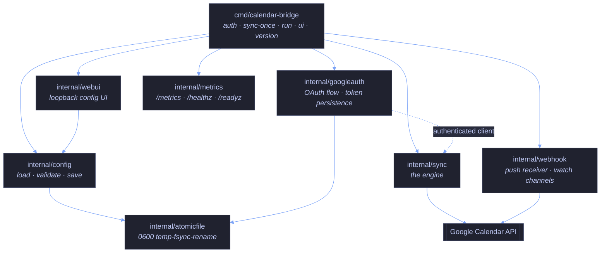
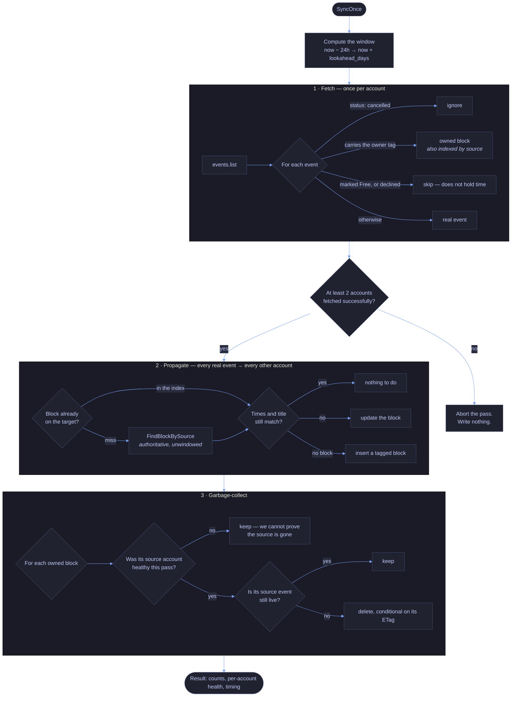
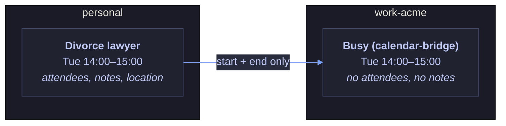
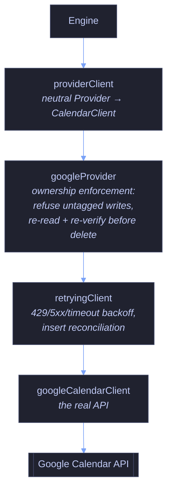

# Architecture

calendar-bridge is a single Go binary that polls N Google Calendar accounts and
keeps a "Busy" placeholder on every calendar for every real event on every
other calendar. It has no database, no server component, and no dependency on
anything you don't run yourself.

---

## Packages

No cycles. `internal/sync` knows nothing about configuration or the CLI; it is
handed a list of accounts and a client per account. `internal/metrics` and
`internal/atomicfile` are leaves.

---

## One sync pass

### Why each step is shaped that way

**The window is `[now − 24h, now + lookahead_days]`.** The 24-hour look-back
exists so an event already in progress when a pass runs is still seen. Without
it, a meeting that started an hour ago would look deleted and its blocks would
be collected mid-meeting.

**A failed account is excluded from the whole pass, not just its own fetch.**
If account B's token expired, we do not know B's current events. We therefore
cannot push blocks to B (we'd duplicate what is already there), and — more
importantly — we cannot garbage-collect blocks *elsewhere* that mirror B's
events, because their absence from our data means "we failed to look", not
"they were deleted". Skipping GC for that account is the difference between a
degraded pass and one that quietly deletes your busy time.

**Fewer than two healthy accounts aborts the pass.** With one account there is
no pair to sync between, and acting on partial data would be guessing.

**The index makes a steady-state pass cheap.** Step 1 already listed every
owned block, so step 2 looks them up in memory rather than issuing a
`FindBlockBySource` call per (event × target). A settled pass costs one API call
per account and nothing else. The lookup remains as a fallback for a block
outside the fetch window — which is exactly what a source event moving back into
range produces.

---

## The ownership invariant

This is the load-bearing idea. Everything else is mechanism.

Every block calendar-bridge creates carries four private extended properties:

| Property | Value |
|---|---|
| `calendarBridgeOwner` | `calendar-bridge` |
| `calendarBridgeSourceAccount` | the account the source event lives on |
| `calendarBridgeSourceCalendarID` | that account's calendar |
| `calendarBridgeSourceEventID` | the source event's opaque ID |

The owner tag is the **only** thing that distinguishes "a placeholder we made"
from "a real event a human made". From that one bit, three guarantees follow:

1. **No sync loops.** An owned block is never classified as a real event, so it
   is never propagated onward. A block on B caused by an event on A does not
   spawn a block on C.
2. **No deletion of real events.** Garbage collection iterates owned blocks
   only. The delete is additionally conditional on the ETag read during the
   fetch, so an event modified in between fails its precondition rather than
   being removed.
3. **Matchable cleanup.** The source identity lets a block be traced back to the
   event it mirrors, which is what makes "is this block's source still alive?"
   answerable at all.

These are enforced at several layers rather than trusted once. The Google client
re-verifies ownership on every lookup rather than trusting the server-side
property filter; the provider layer refuses to insert or update anything without
a complete ownership tag, and re-reads and re-checks the target before every
delete. See the invariant coverage matrix in
[`QUALITY_AUDIT.md`](../QUALITY_AUDIT.md).

**Are those properties private?** Yes. Google's `extendedProperties.private` is
per-copy and per-calendar: an external organiser can set *shared* properties on
an invitation, but not private ones on your copy of it. calendar-bridge only
ever reads `.private`, so a crafted invitation cannot forge the owner tag. See
[THREAT-MODEL.md](THREAT-MODEL.md).

---

## What crosses an account boundary

**No event content.** What does cross is a time span, the fixed `block_title`
string, and synchronization metadata.

The no-content part is structural rather than conventional. The
provider-neutral `Event` type the engine reasons about has fields for an ID, a
start, an end, cancellation, transparency, the owner's invitation response, and
ownership metadata — and no fields at all for a summary, description, location,
or attendees. There is nowhere for event content to flow even if some future
change tried to send it.

The metadata is deliberate and worth knowing about, because it is written onto
the block in the destination calendar as private extended properties:

| Property | Holds |
|---|---|
| `calendarBridgeOwner` | The constant `calendar-bridge`. Carries no information; it is what makes a block distinguishable from a real event. |
| `calendarBridgeSourceAccount` | The **name you gave the source account** in `config.yaml`, e.g. `work-acme`. |
| `calendarBridgeSourceCalendarID` | The source `calendar_id`. Usually `primary`, but a secondary calendar's ID looks like `c_…@group.calendar.google.com`. |
| `calendarBridgeSourceEventID` | Google's opaque ID for the source event. |

Those three source fields are what makes correct garbage collection possible —
a block can be matched back to its origin, so only provably-dead blocks are
removed. Without them the tool could not safely delete anything.

The trade-off: anyone who can read events on the destination calendar can see
which source account and which source calendar a block came from, and can
correlate a block to a specific source event. They cannot see what that event
was. If your account *names* or a secondary `calendar_id` are themselves
sensitive, that is the field to think about — the properties are `private`, so
they are visible to the calendar's own readers rather than to invitees.

The one caveat worth stating: a colleague who can see your work calendar learns
*when* you are busy. That is the entire point, and it is the same information a
Google free/busy share would expose. They do not learn what you are doing.

---

## Client layering

Each account's client is a stack of decorators, outermost first:

Retry sits **below** the provider deliberately: each individual Google call the
provider makes — the pre-delete read as well as the delete itself — gets its own
backoff, rather than a retry replaying a whole check-and-write sequence.

`Provider` is a provider-neutral port. A future Outlook or CalDAV backend
implements it and gets the engine, the retry behaviour and the ownership
enforcement unchanged. `googleProvider` is the first implementation and the
template for the next.

---

## Failure behaviour

| Failure | What happens |
|---|---|
| One account's token expired | That account is excluded from the entire pass. Others still sync. No blocks mirroring its events are collected anywhere. Reported in the result, the logs, and `calendar_bridge_account_healthy`. |
| Transient 429 or 5xx | Retried with exponential backoff and full jitter (4 attempts, capped at 30s). Full jitter is deliberate: it stops several accounts synchronising their retries into a burst. |
| 401/403/404 | Not retried. These need an operator, and retrying wastes quota while delaying the signal. |
| Network timeout on an insert | Ambiguous — the block may have been created. Reconciled with a lookup before any retry, so a retry never creates a duplicate. If the reconciliation lookup itself fails, the pass stops rather than guessing; the next pass resolves it. |
| Event changed between the fetch and its delete | The ETag precondition fails, the delete does not happen, and the next pass re-evaluates. |
| SIGTERM mid-pass | The pass context is cancelled and the process exits promptly. A partial pass is safe: every operation is idempotent, so the next run converges. |
| Fewer than two healthy accounts | The pass aborts having written nothing. |

---

## Idempotency

Every operation converges. A pass computes the desired state and makes only the
writes needed to reach it, so:

- Running two passes back to back performs zero writes on the second.
- A pass interrupted halfway leaves a partial but *correct* state; the next pass
  finishes the job.
- Running `sync-once` by hand while the daemon is running is harmless.

This is asserted directly rather than assumed: the test suite runs a pass, resets
the fake API's call counters, runs an identical pass, and fails if any write
occurred.

---

## Deliberate non-goals

- **No database.** State lives in the calendars themselves, as the ownership
  tags. There is nothing to back up, migrate, or get out of sync.
- **No event mirroring.** Content never crosses accounts. See above.
- **No conflict resolution.** calendar-bridge never modifies a real event, so
  there is nothing to conflict over.
- **No multi-user support.** One process serves one person's set of accounts.
- **No hosted component.** Nothing phones home. There is no update check, no
  telemetry, and no server to be breached.
