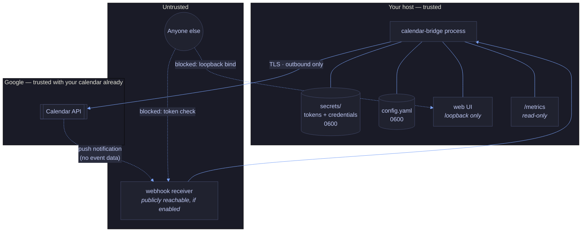

# Threat model

What calendar-bridge protects, what it protects against, and — more usefully —
what it does not.

To report a vulnerability, see [SECURITY.md](../SECURITY.md). Do not open a
public issue.

---

## Assets

Ranked by what an attacker gains.

| Asset | Where it lives | If it leaks |
|---|---|---|
| **OAuth refresh tokens** | `token_file` per account, `0600` | Full read/write access to that account's calendar until revoked at [myaccount.google.com/permissions](https://myaccount.google.com/permissions). This is the crown jewel. A refresh token normally survives indefinitely, but not unconditionally: Google expires them after **7 days** while the OAuth consent screen is in **Testing** publishing status, and revocation, a password change, or Workspace admin policy invalidates them at any time. See [TROUBLESHOOTING](TROUBLESHOOTING.md) if syncs start failing weekly. |
| **OAuth client secret** | `credentials_file` per account, `0600` | On its own, little: an installed-app client secret is not treated as confidential by the OAuth spec, and it cannot be used without a user consenting. Combined with a phishing page it makes a consent screen look legitimate. |
| **Calendar metadata** | Google's servers; transiently in memory | Event times. calendar-bridge never persists event data, never logs titles or attendees, and never writes content to another calendar. |
| **Web UI auth token** | `config.yaml`, `0600` | Read and rewrite of `config.yaml`, and the ability to trigger syncs. Since the config names arbitrary file paths, this is close to arbitrary local file read/write in the process's own privileges — see [Local user](#a-local-user-on-the-same-host). |
| **Webhook verification token** | `config.yaml`, `0600` | The ability to force sync passes by POSTing to the public receiver. No data disclosure; a denial-of-service and quota-burn vector. |

**calendar-bridge is not a secret store.** It reads tokens Google issued and
writes them back when they rotate. Everything below assumes the host's
filesystem permissions actually hold.

---

## Trust boundaries

**Data leaving your infrastructure: nothing but ordinary Calendar API calls to
Google.** No analytics, no telemetry, no update check, no crash reporting, no
third-party service. The only outbound connections are to
`accounts.google.com` and `*.googleapis.com`. You can verify this: the binary
has four direct dependencies and every network call goes through the Google
API client.

---

## Attacker classes

### A local user on the same host

**Assume they win.** A user who can read `token_file` has your calendar. A user
who can run as your UID has everything.

What is done anyway, as defence in depth:

- Token and credential files are created `0600` and rewritten `0600`; a
  pre-existing file with looser permissions is tightened, not left alone.
- calendar-bridge warns at startup if either file is group- or world-readable.
  It does **not** refuse to start — an operator who has deliberately loosened
  permissions is not helped by a crash loop.
- Tokens are written atomically (temp file, fsync, rename), so an interrupted
  write cannot leave a truncated file that reads back as "unauthorized".
- Tokens are never logged, never included in an error message, and never sent
  to the browser. Errors from a corrupt token file deliberately do not quote its
  contents.
- The web UI serves credential and token *paths*, never their contents.

**Not defended against:** memory scraping of the running process, a root user,
a compromised shell, or a backup that captures `secrets/` unencrypted. Tokens
are stored in plaintext on disk — encrypted-at-rest storage (Keychain, age,
systemd credentials) is a known gap, tracked on the roadmap.

### Someone who finds the web UI port

The UI can rewrite `config.yaml`, and the config names arbitrary file paths.
That makes it a privileged local admin surface, and it is treated as one:

- **It refuses to bind any non-loopback address**, auth token or not. It serves
  plaintext HTTP, so a non-loopback listener would put the token and the config
  on the wire in the clear. This is a hard refusal at startup, not a warning.
- A **DNS-rebinding guard**: in the default no-token mode, requests whose `Host`
  header is not a loopback authority are rejected. Without it, a page on a
  hostname rebound to `127.0.0.1` could drive the API from your browser.
- **CSRF protection** on every `/api/*` route via `Sec-Fetch-Site` and `Origin`
  checks.
- The optional bearer token is compared in **constant time over SHA-256
  digests**, so neither its length nor its content leaks through timing.
- A strict CSP with a **per-response nonce** — no `unsafe-inline` — plus
  `frame-ancestors 'none'`, `base-uri 'none'`, `nosniff`, `no-referrer`, and
  `no-store` on every response.
- Request bodies are capped at 1 MiB; the server has read and idle timeouts.
- Concurrent sync requests are rejected rather than allowed to race.

**Residual risk, stated plainly:** on a shared multi-user host, "loopback only"
does not mean "only you" — any local user can reach `127.0.0.1:8090`. Set
`web_ui.auth_token` there, or leave the UI off. And because the UI edits
credential *paths*, someone with UI access can point calendar-bridge at any file
the process can read, and cause a token to be written anywhere it can write.
That is inherent to a config editor; the mitigation is not exposing it.

### Someone who finds the webhook endpoint

Only relevant when `webhook.enabled` is true, which is opt-in.

- Every notification's `X-Goog-Channel-Token` is compared against the configured
  secret in constant time over fixed-width digests; a mismatch is rejected 403
  before any work happens.
- Google's push notifications **carry no event data** — only headers saying
  "something changed on this channel". So even a forged-and-authenticated
  request can at most trigger a reconcile. It can never inject data.
- The receiver never logs the token. The public URL is validated to reject
  embedded credentials, query strings and fragments, and only its scheme and
  host are ever logged.

**Residual risk:** an attacker with the verification token can force syncs and
burn your Calendar API quota. Rotate the token and restart if you suspect this.

### Malicious calendar content

The interesting one, because it is the only attacker who does not need access to
your host.

Someone who can put an event on one of your calendars — anyone who can send you
an invitation — controls that event's title, description, location, attendee
list, and shared extended properties.

- **They cannot forge the ownership tag.** calendar-bridge reads
  `extendedProperties.private`, which is per-copy and per-calendar. An organiser
  sets *shared* properties; they cannot set private ones on your copy. So a
  crafted invitation cannot masquerade as a calendar-bridge block, and cannot
  make calendar-bridge delete or overwrite anything.
- **Event content is never read into anything that persists or propagates.** The
  neutral event model has no description, location or attendee fields, and no
  field carrying a *user's* event title. Injecting a payload into an event title
  has nowhere to go: it is not logged, not copied to another calendar, not
  stored, and not rendered in the web UI.

  The model does have one text field, `Event.Title`, and it is populated only
  for blocks calendar-bridge created itself — where the value is the operator's
  own `block_title`, never anything a person wrote. It is deliberately left
  empty for real events, so a real summary cannot enter the model even by
  accident.
- The web UI builds its DOM with `textContent` and `value`, never `innerHTML`,
  and the CSP forbids inline script without the per-response nonce.

**Residual risk:** an *application* you have separately authorized on one of
your accounts could write private extended properties. Such an app could tag a
real event with the owner sentinel, which would make calendar-bridge treat it as
a block — either suppressing its propagation, or garbage-collecting it. This
requires you to have already granted a hostile app calendar write access, at
which point it can delete your events directly. Noted for completeness rather
than as a practical concern.

### A compromised dependency

The binary has four direct dependencies (`google.golang.org/api`,
`golang.org/x/oauth2`, `github.com/google/uuid`, `gopkg.in/yaml.v3`) and no
vendored native code. A compromised dependency runs with the process's full
privileges and can exfiltrate tokens. There is no in-process defence.

What reduces the window:

- `govulncheck` on every PR and every release, pinned to a tested version.
- CodeQL and OpenSSF Scorecard.
- Dependabot for Go modules, GitHub Actions, and Docker base images.
- Every GitHub Action pinned by commit SHA, not by tag.
- goreleaser pinned to the exact version `2.12.7` — not a range, and not
  `latest`. A range would resolve to the newest matching release at run time,
  which is not a pin. The same version is asserted in CI by the
  `release-config` job, which fails if the two workflows drift apart.
- Base images pinned by digest.
- Releases carry SBOMs, keyless cosign signatures, and build-provenance
  attestations, so you can verify what you downloaded came from this repository's
  release workflow.
- gitleaks over the full history on every PR.

### Google itself

Out of scope, and worth being honest about: Google already has your calendar.
calendar-bridge does not reduce Google's access and does not claim to. The
privacy argument is against adding a *third* party, not against Google.

The OAuth scope is `calendar.events` — the narrowest scope that permits creating
and deleting events. It does not grant calendar creation, deletion, or ACL
management. It does grant read access to event titles and attendees, which is
more than the engine uses; that excess is contained structurally, not by scope.
Any change to the scope set is a security-relevant change and is called out as
one in `.coderabbit.yaml`.

---

## What the design does not defend against

Stated plainly, because a threat model that only lists wins is marketing.

1. **Plaintext tokens at rest.** Anyone with your filesystem has your calendars.
   No OS keychain, no age encryption, no systemd credentials. Tracked as a gap.
2. **A root user or a compromised host.** Complete loss.
3. **A malicious dependency.** Complete loss; only the window is reduced.
4. **A shared multi-user host without an auth token.** Any local user can reach
   the loopback web UI and rewrite your config.
5. **Backups.** If you back up `secrets/` unencrypted, your tokens are in your
   backups. calendar-bridge cannot know or help.
6. **Your Google account itself.** Phishing, session hijacking, and a
   compromised recovery method all bypass everything here.
7. **Traffic analysis.** An observer on your network sees TLS to
   `googleapis.com` on a regular interval and can infer that you run a calendar
   tool and roughly how busy your calendar is from the request volume.
8. **The metrics endpoint if you expose it.** It is read-only and
   unauthenticated by design. It leaks account names, sync timing, and activity
   volume — not event data. Bind it where only your monitoring can reach it.
9. **Availability.** There is no high availability. If the process is down, busy
   blocks go stale. The mitigation is the staleness alert in
   [OBSERVABILITY.md](OBSERVABILITY.md), not redundancy.

---

## Incident response

**If you think a token file leaked:**

1. Revoke calendar-bridge's access for that account at
   [myaccount.google.com/permissions](https://myaccount.google.com/permissions).
   This invalidates the refresh token immediately. Do this first — before
   investigating.
2. Delete the token file.
3. Investigate how it leaked. Check whether backups captured it.
4. Re-run `calendar-bridge auth -account <name>`.
5. Review the account's audit log for events created or deleted while the token
   was exposed. Every block calendar-bridge creates carries the
   `calendarBridgeOwner` property, so anything without it was not created by
   this tool.

**If you think the webhook token leaked:** generate a new one, update
`config.yaml`, and restart. Existing watch channels carry the old token and will
stop being accepted; they are re-registered on startup.

**If you think the web UI auth token leaked:** generate a new one, update
`config.yaml`, restart, and check the config for unexpected changes to
`credentials_file` or `token_file` paths.
